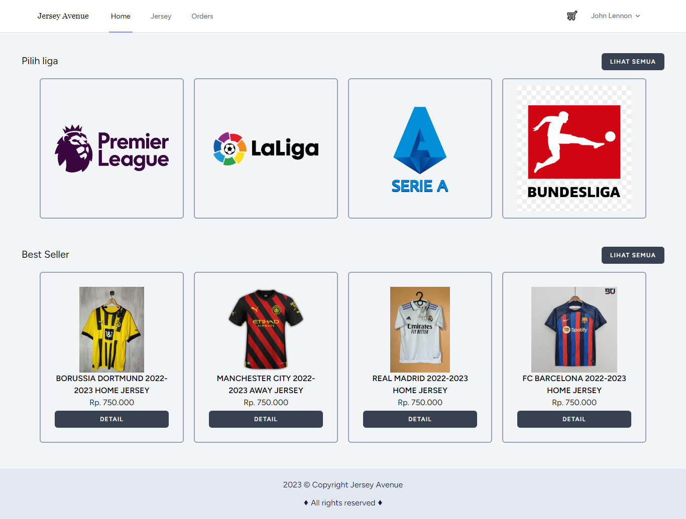

<h1 align="center">
Jersey Avenue
</h1>

<h5 align="center">
Jersey Avenue is a interactive SPA project using TALL Stack (TailwindCSS, AlpineJS, Laravel, Livewire).
</h5>

<p align="center">
    <a href="https://github.com/muhammadhabibfery/jersey-avenue/actions/workflows/test.yml">
        
    </a>
    <a href="https://www.php.net">
        
    </a>
    <a href="https://laravel.com">
        
    </a>
</p>

</br>

| [Frontend Features][] | [Admin Panel Features][] | [Requirements][] | [Install][] | [How to setting][] | [License][] |

## Frontend Features 


<hr>

<hr>

<hr>

<hr>

<hr>


<hr>

<hr>

#### Features

- <b> Home
- <b> List of leagues
- <b> List of jerseys
- <b> Jersey Detail
- <b> Cart
- <b> Checkout and Payment
- <b> Order History
- <b> Change Profile and Password

## Admin Panel Features 


|<h3>Menu  </h3>        |       Description                                                                 |
|-----------------------|-----------------------------------------------------------------------------------|
|<b>Dashboard           | </b>Contains information about all menu.                                          |
|<b>User Management     | </b>Manage customers and employees.                                               |
|<b>League              | </b>Create and manage leagues.                                                    |
|<b>Jersey              | </b>Create and manage jerseys.                                                    |
|<b>Order               | </b>Manage and monitor the transactions.                                          |
|<b>Profile             | </b>Edit own profile and password.                                                |

## Requirements

    Composer packages:
	PHP = ^8.1
    laravel = ^10.x
    laravel/breeze = ^1.x
    filament/filament = ^2.x
    midtrans/midtrans-php = ^2.x
    pusher/pusher-php-server = ^7.x
    beyondcode/laravel-websockets = ^1.x
    barryvdh/laravel-debugbar: ^3.x

    NPM packages:
    tailwindcss = ^3.x
    alpinejs = ^3.x
    laravel-echo = ^1.x
    pusher-js = ^8.x
    turbolinks = ^5.x

## Install

Clone repo

```
git clone https://github.com/muhammadhabibfery/jersey-avenue.git
```

Install Composer


[Download Composer](https://getcomposer.org/download/)


composer install/update 

```
composer install
```

Install Nodejs


[Download Node.js](https://nodejs.org/en/download/)


NPM dependencies
```
npm install
```

Run Vite 

```
npm run dev
```

## How to setting 

Copy .env.example

```
cp .env.example .env
```

Go into .env file change Database and Email credentials. Then setup some configuration with your own credentials
```
BROADCAST_DRIVER=pusher
QUEUE_CONNECTION=database

PUSHER_APP_ID=justRandomString
PUSHER_APP_KEY=justRandomString
PUSHER_APP_SECRET=justRandomString
PUSHER_HOST=127.0.0.1
PUSHER_PORT=6001
PUSHER_SCHEME=https|http   (Just choose one)
PUSHER_APP_CLUSTER=mt1

RAJAONGKIR_API_KEY=<Your-API-Key>

MIDTRANS_SERVER_KEY = <Your-Server-Key>
MIDTRANS_PRODUCTION = false
MIDTRANS_SANITIZED = true
MIDTRANS_3DS = true|false   (Just choose one)

<!-- If you are using laravel valet and https protocol, add your valet path below -->
LARAVEL_WEBSOCKETS_SSL_LOCAL_CERT='/Users/YOUR-USERNAME/.config/valet/Certificates/VALET-SITE.TLD.crt'
LARAVEL_WEBSOCKETS_SSL_LOCAL_PK='/Users/YOUR-USERNAME/.config/valet/Certificates/VALET-SITE.TLD.key'
LARAVEL_WEBSOCKETS_SSL_PASSPHRASE=''

```

Run the migration

```
php artisan migrate
```

Or run the migration with seeder if you want seeding the related data

```
php artisan migrate --seed
```

Generate a New Application Key

```
php artisan key:generate
```

Create a symbolic link

```
php artisan storage:link
```

Don't forget to setup and run the queue worker and websocket server

```
php artisan queue:work | php artisan queue:listen
php artisan websockets:serve
```

## License

> Copyright (C) 2023 Muhammad Habib Fery.  
**[⬆ back to top](#jersey-avenue)**

[Frontend Features]:#frontend-features
[Admin Panel Features]:#admin-panel-features
[Requirements]:#requirements
[Install]:#install
[How to setting]:#how-to-setting
[License]:#license
